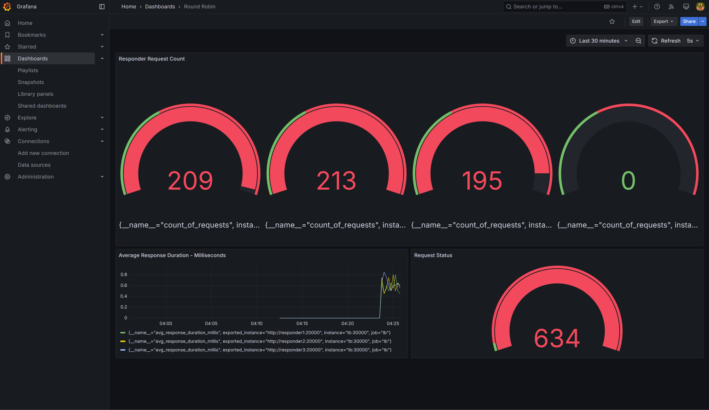

# Round robin

## Overview

We have two services here:

### [responder](responder)

This takes any json input and reponds back with the request body. It also has a trivial health check api.

Routes:

- `POST /json`
- `GET /health`
- `GET /metrics` - For Prometheus

### [lb (round robin server)](lb)

This accepts an, optional, comma separated list of uris to instances of the `responder` service and routes requests to the their json apis in a round robin strategy. It also makes an effort to handle slowdowns and disconnections to the configured instances of `responder`.

Routes:

- `POST /json`
- `PUT /addinstance`
- `PUT /removeinstance`
- `GET /status`
- `GET /metrics` - For Prometheus

### Tech

Both services are written and built with [Golang](https://go.dev/).

Unit tests are included with both services. Run them with:

```bash
cd responder
go test -v
```

and

```bash
cd lb
go test -v
```

## Run (in Docker)

- Make sure [docker engine](https://docs.docker.com/engine/install/) is installed and running
- Make sure [docker compose](https://docs.docker.com/compose/install/) is installed
- Clone and `cd` to root of repository and run:

```bash
docker compose up -d
```

This runs `lb` at `:30000`. It also spawns 4 instances of `responder` with ports `:20000`, `:20001`, `:20002` and `:20003`

Finally it spawns a Prometheus and a Grafana server. Prometheus is pre-configured to receive metrics from the 5 spawned containers. Grafana is pre-configured with Prometheus as a datasource.

Once the containers are up - it's time to make a lot of requests. A bash file in the repo root, [lotofreq.sh](lotofreq.sh), makes 5 requests every second - for a total of 10000 - to `lb`.

Make sure `bash` is installed and run:

```bash
./lotofreq.sh
```

## Grafana

- Go to [http://localhost:3000]((http://localhost:3000)) and login with

```env
username: admin
password: grafana
```

There is an exported dashboard json file included in the repo at [grafana/rrDashboard.json](grafana/rrDashboard.json).

Import it into Grafana - and we should have a dashboard looking like this:



## Stress responder3

The container **`responder3`** is built with [stress-ng](https://wiki.ubuntu.com/Kernel/Reference/stress-ng) included - infact the entirety of Debian is included - so that this can be logged into and tools can be installed and run here if needed.

The remaining `responder` containers are built with Google's [distroless image](https://github.com/GoogleContainerTools/distroless)  to save space.

Log into the container:

```bash
docker exec -it responder3 bash
```

and stress:

```bash
/stress-ng --cpu 16 --cpu-method fft --timeout 5m
```

Once the average response duration for `responder3` crosses `10ms` - it will start getting ignored by `lb`. `5 seconds` after that requests to it will be retried until average response duration crosses `10ms` again. This loop continues repeating.

The same behavior is applicable for every `responder` instance configured in `lb`.

Also stop and restart other `responder` containers to test how `lb` handles request routing and health check.

## Extras

### Add instance

```bash
curl -X PUT --data 'http://responder4:20000' localhost:30000/addinstance
```

### Remove instance

```bash
curl -X PUT --data 'http://responder4:20000' localhost:30000/removeinstance
```
